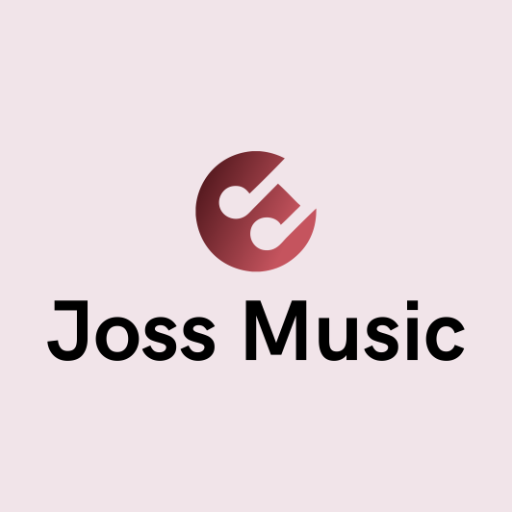

    
    <h1>Joss Music</h1>
    
Una aplicación de Android de transmisión de música desde YouTube Music basado en ViMusic

---

## Características
- Reproduce (casi) cualquier canción o video de YouTube Music
- Reproducción en segundo plano
- Almacena fragmentos de audio en caché para reproducción sin conexión
- Busca canciones, álbumes, videos de artistas y listas de reproducción
- Marca artistas y álbumes como favoritos
- Importa listas de reproducción
- Obtiene, muestra y edita letras de canciones o letras sincronizadas
- Administración de listas de reproducción locales
- Reordena canciones en listas de reproducción o colas
- Tema claro/oscuro/dinámico
- Omite silencios
- Temporizador de apagado automático
- Normalización de audio
- Android Auto
- Cola persistente
- Abre enlaces de YouTube/YouTube Music (`watch`, `playlist`, `channel`)
- ...

## Installation

## Agradecimientos
- [**YouTube-Internal-Clients**](https://github.com/zerodytrash/YouTube-Internal-Clients): Un script de Python que descubre clientes API de YouTube ocultos. Solo un proyecto de investigación.
- [**ionicons**](https://github.com/ionic-team/ionicons): Íconos premium hechos a mano y creados por Ionic, para aplicaciones Ionic y aplicaciones web en todas partes.

<a href="https://www.flaticon.com/authors/ilham-fitrotul-hayat" title="íconos de música">Ícono de aplicación basado en el ícono creado por Ilham Fitrotul Hayat - Flaticon</a>

## Aviso legal
Este proyecto y sus contenidos no están afiliados, financiados, autorizados, respaldados ni asociados de ninguna manera con YouTube, Google LLC o cualquiera de sus filiales y subsidiarias.

Todas las marcas comerciales, marcas de servicio, nombres comerciales u otros derechos de propiedad intelectual utilizados en este proyecto son propiedad de sus respectivos propietarios.